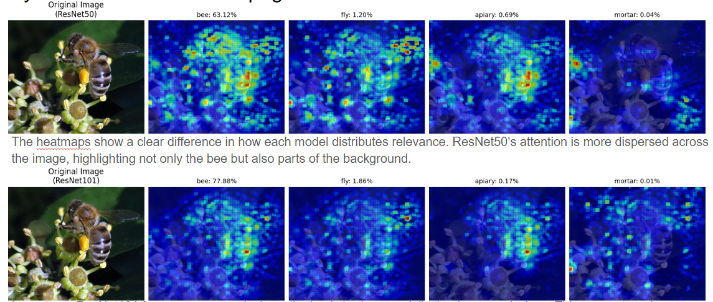
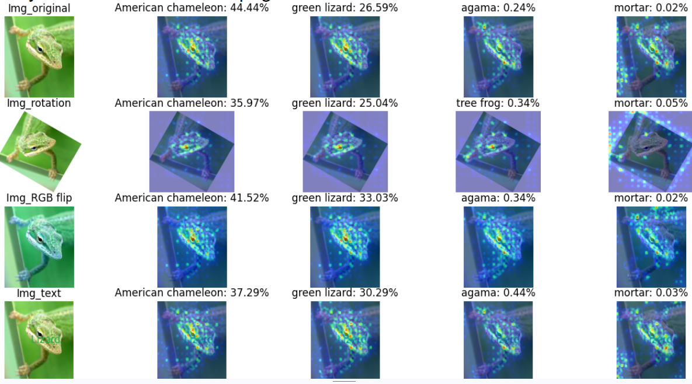
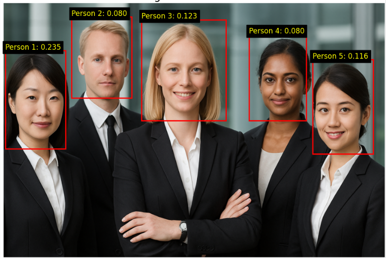
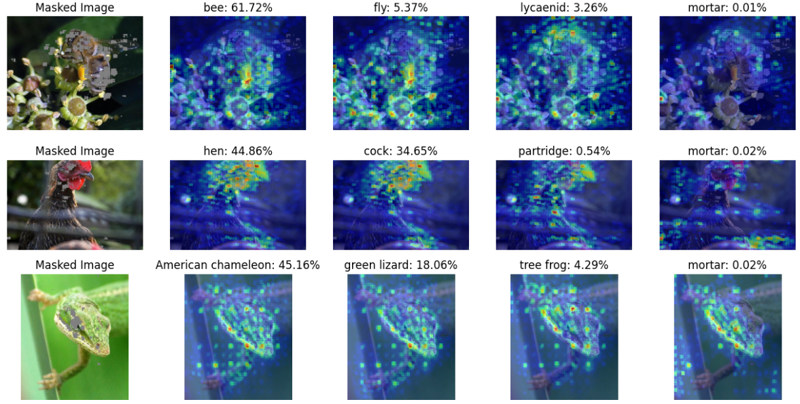

# ResNet LRP Visualization

This repository provides tools for visualizing and comparing Layer-wise Relevance Propagation (LRP) attention maps for ResNet50 and ResNet101 models using PyTorch and Zennit. It supports analysis of different image variants and quantifies model attention on face regions in images.

## Features

- **ResNet50/ResNet101 LRP Visualization**: Compare LRP attention maps between ResNet50 and ResNet101 on the same image.
- **Image Variant Analysis**: Visualize LRP results for original, rotated, RGB-flipped, and text-modified images.
- **Face Attention Scoring**: Interactively select face regions in an image and quantify model attention for each face.
- **Multi-class Comparison**: Generate LRP heatmaps for the top predicted classes.

## File Overview

- **lrp_compare_resnet50_resnet101.py**  
  Compares LRP attention maps of ResNet50 and ResNet101 on a single image, supporting multi-class analysis and visualization.

- **resnet_attention_faces.py**  
  Allows manual selection of face bounding boxes in an image, computes LRP scores for each face, and visualizes the attention distribution.

- **resnet101_image_variants.py**  
  Analyzes LRP attention maps for various image variants using ResNet101, displaying results in a grid for easy comparison.

## Requirements

- Python 3.8+
- torch
- torchvision
- numpy
- matplotlib
- scikit-image
- pillow
- requests
- zennit

Install dependencies:
```bash
pip install torch torchvision numpy matplotlib scikit-image pillow requests zennit
```

## Usage

1. **Prepare Images**  
   Place your images in the `img/` or `imgs/` directory and update the image paths in the scripts as needed.

2. **Run Scripts**
   - Compare ResNet50 and ResNet101 LRP:
     ```bash
     python lrp_compare_resnet50_resnet101.py
     ```
   - Face attention analysis:
     ```bash
     python resnet_attention_faces.py
     ```
   - Image variant LRP visualization:
     ```bash
     python resnet101_image_variants.py
     ```

3. **Interactive Steps**  
   For face analysis, manually click on the image to select face bounding boxes as prompted.

## Results

- Visualizations overlay LRP heatmaps on the original images for intuitive understanding of model focus.
- Supports comparison across models, classes, and image variants.
- Face analysis script highlights the most attended face automatically.

## Visualization Examples

<p align="center">
  
  <br><b>Figure 1:</b> LRP attention map comparison between ResNet50 and ResNet101.
</p>

<p align="center">
  
  <br><b>Figure 2:</b> LRP visualization for various image augmentations.
</p>

<p align="center">
  
  <br><b>Figure 3:</b> Model attention scores for different faces in an image.
</p>

<p align="center">
  
  <br><b>Figure 4:</b> Example of LRP mask visualization.
</p>